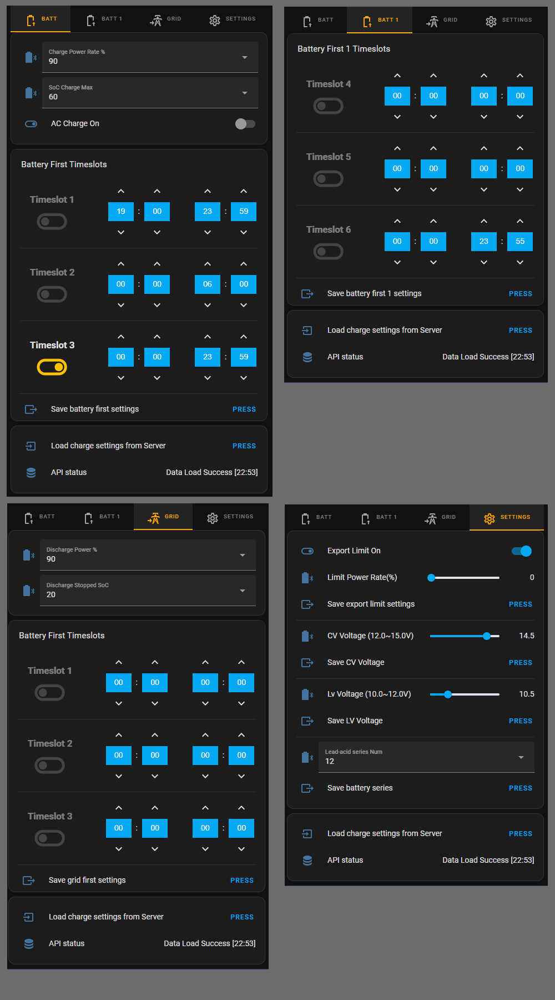

# ad-growatt

An AppDaemon App Example for controlling Growatt Inverters via HomeAssistant.

This is a further development of the original code by mjdyson. The following are the main changes:
- Ability to control Grid First, Battery First and Export Limit
- UI now consists of one Lovelace card
- Improved error handling, eg. handling the lock-out by displaying a message
- Can only handle one inverter, specify Device Serial Number in secrets together with username and password for inverter

!! Growatt API was updated during September 2023. That update pretty much broke all Growatt integrations. Growatt is not offering any solutions, they focus on blocking enthusiast trying to make Growatt products work with home automation. Currently this code (AD Growatt) is not working due to Growatt servers blocking access. It might work again some time in the future and everyone are very welcome to try to use my code for future versions.
Personally I gave up on Growatt servers and will be using Solar Assistant going forward. So Long, and Thanks for All the Fish :)

# Versions
v0.1 July 13. 2023: initial release

v0.2 August 8. 2023: Seperates the save functions to avoid timeouts and API overload. Update config.yaml and growatt_app.py files + Lovelace card. Automations have to be changed to conform with new save

v.03 August 14. 2023: Control of "Grid first, discharge power" implemented together with other improvements, eg. more robustnness when saving; now retrying 5 times, if theres's a problem with Growatt server. Remember to update the Lovelace card with the code below.

v.04 September 19. 2023: Charge power setting added, thanks to Jasperwolsing (added getting charge power on top of the Jasperwolsing change). Services adgw_battery_first_on and adgw_battery_first_off added to control the battery first state on/off from scripts. 

v.041 September 26. 2023: Changed initialization to more correctly show if there's a 50x error.

v.05 March 16. 2024: Growatt communication re-engeneered to avoid blocking, new settings


# Installation
The steps to set up is:

1. If you have the old Growatt integration installed, remove it, as it might trigger the server block on Growatt servers. For monitoring, use Grott https://github.com/johanmeijer/grott. This step is optional but will improve stability greatly.

2. Install AppDaemon from Add-ons in HA

	* Modify configuration file `ADDON_CONFIGS\a0d7b954_appdaemon\appdaemon.yaml` and add link to secrets if missing
```
secrets: /homeassistant/secrets.yaml
appdaemon:
  latitude: xx.xxxxx
  longitude: x.xxxxxx
  elevation: 2
  time_zone: Europe/Amsterdam
  plugins:
    HASS:
      type: hass
http:
  url: http://127.0.0.1:5050
  transport: socketio
admin:
api:
hadashboard:
```

	

3. Copy directory from `ad-growatt/appdaemon/`  on Github to your  directory `ADDON_CONFIGS/a0d7b954_appdaemon/`

4. Copy directory from `ad-growatt/packages/`  on Github to your  directory `/config/`


4. Modify /config/configuration.yaml to include
```
homeassistant:
  packages: !include_dir_named packages
```

5. Modify /config/secrets to include:
```
growatt_username: XXX
growatt_password: XXX
growatt_device: XXX
```
Replacing X’s with login, password and Device Serial Number (found on main page of Growatt Server: Login Page https://server.growatt.com/)

6. Restart HA, or just reload HA configuration and restart AppDaemon

7. Create the Lovelace card, see code above

Enjoy controlling your Growatt inverter directly from HA !!

# UI Dependencies
Following dependencies are used by UI card:

* <a href="https://github.com/kinghat/tabbed-card">Tabbed Card</a>
* <a href="https://github.com/custom-cards/stack-in-card">Stack In Card</a>
* <a href="https://github.com/thomasloven/lovelace-card-mod">Card Mod</a>
* <a href="https://github.com/custom-cards/button-card">Button Card</a>
* <a href="https://github.com/GeorgeSG/lovelace-time-picker-card">Time Picker Card</a>

 

# Lovelace card
```
type: vertical-stack
cards:
  - type: custom:tabbed-card
    options: {}
    styles:
      '--mdc-theme-primary': orange
      '--mdc-tab-text-label-color-default': grey
      '--mdc-typography-button-font-size': 10px
      '--mdc-tab-stacked-height': 55px
    tabs:
      - attributes:
          label: Batt
          icon: mdi:battery-arrow-up-outline
        card:
          type: vertical-stack
          card_mod:
            style: |
              ha-card {
                margin: 0px;
              }
          cards:
            - type: entities
              entities:
                - entity: input_select.adgw_battery_charge_power
                - entity: input_select.adgw_battery_charge_max_soc
                - entity: input_boolean.adgw_ac_charge_on
            - type: custom:stack-in-card
              mode: vertical
              keep:
                background: true
                box_shadow: false
                margin: false
                outer_padding: false
                border_radius: false
              card_mod:
                style:
                  hui-vertical-stack-card $: |
                    div#root > * {
                      margin: 0px !important;
                      --ha-card-border-width: 0;
                    }
              cards:
                - type: custom:mushroom-title-card
                  title: Battery First Timeslots
                - type: custom:stack-in-card
                  mode: horizontal
                  keep:
                    box_shadow: true
                    background: false
                    border_radius: true
                    margin: false
                    outer_padding: false
                  cards:
                    - type: custom:stack-in-card
                      mode: horizontal
                      keep:
                        background: false
                        box_shadow: false
                        margin: false
                        outer_padding: false
                        border_radius: false
                      cards:
                        - type: custom:button-card
                          entity: input_boolean.adgw_battery_first_time_slot_1_enabled
                          icon: mdi:toggle-switch-off-outline
                          show_icon: true
                          show_state: false
                          show_name: true
                          name: Timeslot 1
                          layout: name_state
                          styles:
                            name:
                              - padding-top: 20px
                              - font-weight: bold
                            grid:
                              - grid-template-areas: '"n" "i" "l" "s"'
                              - grid-template-rows: min-content 1fr min-content min-content
                              - grid-template-columns: 1fr
                          state:
                            - value: 'off'
                              icon: mdi:toggle-switch-off-outline
                              styles:
                                card:
                                  - filter: opacity(50%)
                                icon:
                                  - filter: grayscale(100%)
                            - value: 'on'
                              icon: mdi:toggle-switch-outline
                          card_mod:
                            style: |
                              ha-card {
                                margin: 0px;
                                border: none;
                                background: none;
                              }
                        - type: custom:time-picker-card
                          entity: input_datetime.adgw_battery_first_time_slot_1_start
                          hour_mode: 24
                          hour_step: 1
                          minute_step: 5
                          layout:
                            hour_mode: double
                            align_controls: center
                            name: inside
                            embedded: false
                            thin: true
                          hide:
                            seconds: true
                            name: true
                            icon: true
                          name: '1'
                          link_values: false
                          card_mod:
                            style: |
                              ha-card {
                                margin: 0px;
                                border: 0px;
                                background: none;
                              }
                        - type: custom:time-picker-card
                          entity: input_datetime.adgw_battery_first_time_slot_1_end
                          hour_mode: 24
                          hour_step: 1
                          minute_step: 5
                          layout:
                            hour_mode: double
                            align_controls: center
                            name: inside
                            embedded: false
                            thin: true
                          hide:
                            seconds: true
                            name: true
                            icon: true
                          link_values: false
                          card_mod:
                            style: |
                              ha-card {
                                margin: 0px;
                                border: none;
                                background: none;
                              }
                - type: entities
                  card_mod:
                    style: |
                      ha-card div {
                        padding-top: 0px !important;
                        padding-bottom: 0px !important;
                      }
                  entities:
                    - type: divider
                - type: custom:stack-in-card
                  mode: horizontal
                  keep:
                    box_shadow: true
                    background: false
                    border_radius: true
                    margin: false
                    outer_padding: false
                  cards:
                    - type: horizontal-stack
                      cards:
                        - type: custom:button-card
                          entity: input_boolean.adgw_battery_first_time_slot_2_enabled
                          icon: mdi:toggle-switch-off-outline
                          show_icon: true
                          show_state: false
                          show_name: true
                          name: Timeslot 2
                          layout: name_state
                          styles:
                            name:
                              - padding-top: 20px
                              - font-weight: bold
                            grid:
                              - grid-template-areas: '"n" "i" "l" "s"'
                              - grid-template-rows: min-content 1fr min-content min-content
                              - grid-template-columns: 1fr
                          state:
                            - value: 'off'
                              icon: mdi:toggle-switch-off-outline
                              styles:
                                card:
                                  - filter: opacity(50%)
                                icon:
                                  - filter: grayscale(100%)
                            - value: 'on'
                              icon: mdi:toggle-switch-outline
                          card_mod:
                            style: |
                              ha-card {
                                margin: 0px;
                                border: none;
                                background: none;
                              }
                        - type: custom:time-picker-card
                          entity: input_datetime.adgw_battery_first_time_slot_2_start
                          name: '2'
                          hour_mode: 24
                          hour_step: 1
                          minute_step: 5
                          layout:
                            hour_mode: double
                            align_controls: center
                            name: inside
                            embedded: false
                            thin: true
                          hide:
                            seconds: true
                            name: true
                            icon: true
                          link_values: false
                          card_mod:
                            style: |
                              ha-card {
                                margin: 0px;
                                border: none;
                                background: none;
                              }
                        - type: custom:time-picker-card
                          entity: input_datetime.adgw_battery_first_time_slot_2_end
                          hour_mode: 24
                          hour_step: 1
                          minute_step: 5
                          layout:
                            hour_mode: double
                            align_controls: center
                            name: inside
                            embedded: false
                            thin: true
                          hide:
                            seconds: true
                            name: true
                            icon: true
                          link_values: false
                          card_mod:
                            style: |
                              ha-card {
                                margin: 0px;
                                border: none;
                                background: none;
                              }
                - type: entities
                  card_mod:
                    style: |
                      ha-card div {
                        padding-top: 0px !important;
                        padding-bottom: 0px !important;
                      }
                  entities:
                    - type: divider
                - type: custom:stack-in-card
                  mode: horizontal
                  keep:
                    box_shadow: true
                    background: false
                    border_radius: true
                    margin: false
                    outer_padding: false
                  cards:
                    - type: horizontal-stack
                      cards:
                        - type: custom:button-card
                          entity: input_boolean.adgw_battery_first_time_slot_3_enabled
                          icon: mdi:toggle-switch-off-outline
                          show_icon: true
                          show_state: false
                          show_name: true
                          name: Timeslot 3
                          layout: name_state
                          styles:
                            name:
                              - padding-top: 20px
                              - font-weight: bold
                            grid:
                              - grid-template-areas: '"n" "i" "l" "s"'
                              - grid-template-rows: min-content 1fr min-content min-content
                              - grid-template-columns: 1fr
                          state:
                            - value: 'off'
                              icon: mdi:toggle-switch-off-outline
                              styles:
                                card:
                                  - filter: opacity(50%)
                                icon:
                                  - filter: grayscale(100%)
                            - value: 'on'
                              icon: mdi:toggle-switch-outline
                          card_mod:
                            style: |
                              ha-card {
                                margin: 0px;
                                border: none;
                                background: none;
                              }
                        - type: custom:time-picker-card
                          entity: input_datetime.adgw_battery_first_time_slot_3_start
                          name: '3'
                          hour_mode: 24
                          hour_step: 1
                          minute_step: 5
                          layout:
                            hour_mode: double
                            align_controls: center
                            name: inside
                            embedded: false
                            thin: true
                          hide:
                            seconds: true
                            name: true
                            icon: true
                          link_values: false
                          card_mod:
                            style: |
                              ha-card {
                                margin: 0px;
                                border: none;
                                background: none;
                              }
                        - type: custom:time-picker-card
                          entity: input_datetime.adgw_battery_first_time_slot_3_end
                          hour_mode: 24
                          hour_step: 1
                          minute_step: 5
                          layout:
                            hour_mode: double
                            align_controls: center
                            name: inside
                            embedded: false
                            thin: true
                          hide:
                            seconds: true
                            name: true
                            icon: true
                          link_values: false
                          card_mod:
                            style: |
                              ha-card {
                                margin: 0px;
                                border: none;
                                background: none;
                              }
                - type: entities
                  card_mod:
                    style: |
                      ha-card div {
                        padding-top: 0px !important;
                        padding-bottom: 0px !important;
                      }
                  entities:
                    - type: divider
                    - entity: >-
                        input_button.adgw_set_charge_settings_button_battery_first
      - attributes:
          label: Batt 1
          icon: mdi:battery-arrow-up-outline
        card:
          type: vertical-stack
          card_mod:
            style: |
              ha-card {
                margin: 0px;
              }
          cards:
            - type: custom:stack-in-card
              mode: vertical
              keep:
                background: true
                box_shadow: false
                margin: false
                outer_padding: false
                border_radius: false
              card_mod:
                style:
                  hui-vertical-stack-card $: |
                    div#root > * {
                      margin: 0px !important;
                      --ha-card-border-width: 0;
                    }
              cards:
                - type: custom:mushroom-title-card
                  title: Battery First 1 Timeslots
                - type: custom:stack-in-card
                  mode: horizontal
                  keep:
                    box_shadow: true
                    background: false
                    border_radius: true
                    margin: false
                    outer_padding: false
                  card_mod:
                    style: |
                      ha-card {
                        margin: 0px;
                        border: none;
                      }
                  cards:
                    - type: horizontal-stack
                      cards:
                        - type: custom:button-card
                          entity: input_boolean.adgw_battery_first_time_slot_4_enabled
                          icon: mdi:toggle-switch-off-outline
                          show_icon: true
                          show_state: false
                          show_name: true
                          name: Timeslot 4
                          layout: name_state
                          styles:
                            name:
                              - padding-top: 20px
                              - font-weight: bold
                            grid:
                              - grid-template-areas: '"n" "i" "l" "s"'
                              - grid-template-rows: min-content 1fr min-content min-content
                              - grid-template-columns: 1fr
                          state:
                            - value: 'off'
                              icon: mdi:toggle-switch-off-outline
                              styles:
                                card:
                                  - filter: opacity(50%)
                                icon:
                                  - filter: grayscale(100%)
                            - value: 'on'
                              icon: mdi:toggle-switch-outline
                          card_mod:
                            style: |
                              ha-card {
                                margin: 0px;
                                border: none;
                                background: none;
                              }
                        - type: custom:time-picker-card
                          entity: input_datetime.adgw_battery_first_time_slot_4_start
                          name: '4'
                          hour_mode: 24
                          hour_step: 1
                          minute_step: 5
                          layout:
                            hour_mode: double
                            align_controls: center
                            name: inside
                            embedded: false
                            thin: true
                          hide:
                            seconds: true
                            name: true
                            icon: true
                          link_values: false
                          card_mod:
                            style: |
                              ha-card {
                                margin: 0px;
                                border: none;
                                background: none;
                              }
                        - type: custom:time-picker-card
                          entity: input_datetime.adgw_battery_first_time_slot_4_end
                          hour_mode: 24
                          hour_step: 1
                          minute_step: 5
                          layout:
                            hour_mode: double
                            align_controls: center
                            name: inside
                            embedded: false
                            thin: true
                          hide:
                            seconds: true
                            name: true
                            icon: true
                          link_values: false
                          card_mod:
                            style: |
                              ha-card {
                                margin: 0px;
                                border: none;
                                background: none;
                              }
                - type: entities
                  card_mod:
                    style: |
                      ha-card div {
                        padding-top: 0px !important;
                        padding-bottom: 0px !important;
                      }
                  entities:
                    - type: divider
                - type: custom:stack-in-card
                  mode: horizontal
                  keep:
                    box_shadow: true
                    background: false
                    border_radius: true
                    margin: false
                    outer_padding: false
                  card_mod:
                    style: |
                      ha-card {
                        margin: 0px;
                        padding: 0px;
                        border: 1px;
                      }
                  cards:
                    - type: horizontal-stack
                      cards:
                        - type: custom:button-card
                          entity: input_boolean.adgw_battery_first_time_slot_5_enabled
                          icon: mdi:toggle-switch-off-outline
                          show_icon: true
                          show_state: false
                          show_name: true
                          name: Timeslot 5
                          layout: name_state
                          styles:
                            name:
                              - padding-top: 20px
                              - font-weight: bold
                            grid:
                              - grid-template-areas: '"n" "i" "l" "s"'
                              - grid-template-rows: min-content 1fr min-content min-content
                              - grid-template-columns: 1fr
                          state:
                            - value: 'off'
                              icon: mdi:toggle-switch-off-outline
                              styles:
                                card:
                                  - filter: opacity(50%)
                                icon:
                                  - filter: grayscale(100%)
                            - value: 'on'
                              icon: mdi:toggle-switch-outline
                          card_mod:
                            style: |
                              ha-card {
                                margin: 0px;
                                border: none;
                                background: none;
                              }
                        - type: custom:time-picker-card
                          entity: input_datetime.adgw_battery_first_time_slot_5_start
                          name: '5'
                          hour_mode: 24
                          hour_step: 1
                          minute_step: 5
                          layout:
                            hour_mode: double
                            align_controls: center
                            name: inside
                            embedded: false
                            thin: true
                          hide:
                            seconds: true
                            name: true
                            icon: true
                          link_values: false
                          card_mod:
                            style: |
                              ha-card {
                                margin: 0px;
                                border: none;
                                background: none;
                              }
                        - type: custom:time-picker-card
                          entity: input_datetime.adgw_battery_first_time_slot_5_end
                          hour_mode: 24
                          hour_step: 1
                          minute_step: 5
                          layout:
                            hour_mode: double
                            align_controls: center
                            name: inside
                            embedded: false
                            thin: true
                          hide:
                            seconds: true
                            name: true
                            icon: true
                          link_values: false
                          card_mod:
                            style: |
                              ha-card {
                                margin: 0px;
                                border: none;
                                background: none;
                              }
                - type: entities
                  card_mod:
                    style: |
                      ha-card div {
                        padding-top: 0px !important;
                        padding-bottom: 0px !important;
                      }
                  entities:
                    - type: divider
                - type: custom:stack-in-card
                  mode: horizontal
                  keep:
                    box_shadow: true
                    background: false
                    border_radius: true
                    margin: false
                    outer_padding: false
                  card_mod:
                    style: |
                      ha-card {
                        margin: 0px;
                        border: none;
                      }
                  cards:
                    - type: horizontal-stack
                      cards:
                        - type: custom:button-card
                          entity: input_boolean.adgw_battery_first_time_slot_6_enabled
                          icon: mdi:toggle-switch-off-outline
                          show_icon: true
                          show_state: false
                          show_name: true
                          name: Timeslot 6
                          layout: name_state
                          styles:
                            name:
                              - padding-top: 20px
                              - font-weight: bold
                            grid:
                              - grid-template-areas: '"n" "i" "l" "s"'
                              - grid-template-rows: min-content 1fr min-content min-content
                              - grid-template-columns: 1fr
                          state:
                            - value: 'off'
                              icon: mdi:toggle-switch-off-outline
                              styles:
                                card:
                                  - filter: opacity(50%)
                                icon:
                                  - filter: grayscale(100%)
                            - value: 'on'
                              icon: mdi:toggle-switch-outline
                          card_mod:
                            style: |
                              ha-card {
                                margin: 0px;
                                border: none;
                                background: none;
                              }
                        - type: custom:time-picker-card
                          entity: input_datetime.adgw_battery_first_time_slot_6_start
                          name: '6'
                          hour_mode: 24
                          hour_step: 1
                          minute_step: 5
                          layout:
                            hour_mode: double
                            align_controls: center
                            name: inside
                            embedded: false
                            thin: true
                          hide:
                            seconds: true
                            name: true
                            icon: true
                          link_values: false
                          card_mod:
                            style: |
                              ha-card {
                                margin: 0px;
                                border: none;
                                background: none;
                              }
                        - type: custom:time-picker-card
                          entity: input_datetime.adgw_battery_first_time_slot_6_end
                          hour_mode: 24
                          hour_step: 1
                          minute_step: 5
                          layout:
                            hour_mode: double
                            align_controls: center
                            name: inside
                            embedded: false
                            thin: true
                          hide:
                            seconds: true
                            name: true
                            icon: true
                          link_values: false
                          card_mod:
                            style: |
                              ha-card {
                                margin: 0px;
                                border: none;
                                background: none;
                              }
                - type: entities
                  card_mod:
                    style: |
                      ha-card div {
                        padding-top: 0px !important;
                        padding-bottom: 0px !important;
                      }
                  entities:
                    - type: divider
                    - entity: >-
                        input_button.adgw_set_charge_settings_button_battery_1_first
      - attributes:
          label: Grid
          icon: mdi:transmission-tower-import
        card:
          type: vertical-stack
          cards:
            - type: entities
              entities:
                - entity: input_select.adgw_grid_discharge_power
                - entity: input_select.adgw_grid_discharge_stopped_soc
            - type: custom:stack-in-card
              mode: vertical
              keep:
                background: true
                box_shadow: false
                margin: false
                outer_padding: false
                border_radius: false
              card_mod:
                style:
                  hui-vertical-stack-card $: |
                    div#root > * {
                      margin: 0px !important;
                      --ha-card-border-width: 0;
                    }
              cards:
                - type: custom:mushroom-title-card
                  title: Grid First Timeslots
                - type: custom:stack-in-card
                  mode: horizontal
                  keep:
                    box_shadow: true
                    background: false
                    border_radius: true
                    margin: false
                    outer_padding: false
                  cards:
                    - type: custom:stack-in-card
                      mode: horizontal
                      keep:
                        background: false
                        box_shadow: false
                        margin: false
                        outer_padding: false
                        border_radius: false
                      cards:
                        - type: custom:button-card
                          entity: input_boolean.adgw_grid_first_time_slot_1_enabled
                          icon: mdi:toggle-switch-off-outline
                          show_icon: true
                          show_state: false
                          show_name: true
                          name: Timeslot 1
                          layout: name_state
                          styles:
                            name:
                              - padding-top: 20px
                              - font-weight: bold
                            grid:
                              - grid-template-areas: '"n" "i" "l" "s"'
                              - grid-template-rows: min-content 1fr min-content min-content
                              - grid-template-columns: 1fr
                          state:
                            - value: 'off'
                              icon: mdi:toggle-switch-off-outline
                              styles:
                                card:
                                  - filter: opacity(50%)
                                icon:
                                  - filter: grayscale(100%)
                            - value: 'on'
                              icon: mdi:toggle-switch-outline
                          card_mod:
                            style: |
                              ha-card {
                                margin: 0px;
                                border: none;
                                background: none;
                              }
                        - type: custom:time-picker-card
                          entity: input_datetime.adgw_grid_first_time_slot_1_start
                          hour_mode: 24
                          hour_step: 1
                          minute_step: 5
                          layout:
                            hour_mode: double
                            align_controls: center
                            name: inside
                            embedded: false
                            thin: true
                          hide:
                            seconds: true
                            name: true
                            icon: true
                          name: '1'
                          link_values: false
                          card_mod:
                            style: |
                              ha-card {
                                margin: 0px;
                                border: 0px;
                                background: none;
                              }
                        - type: custom:time-picker-card
                          entity: input_datetime.adgw_grid_first_time_slot_1_end
                          hour_mode: 24
                          hour_step: 1
                          minute_step: 5
                          layout:
                            hour_mode: double
                            align_controls: center
                            name: inside
                            embedded: false
                            thin: true
                          hide:
                            seconds: true
                            name: true
                            icon: true
                          link_values: false
                          card_mod:
                            style: |
                              ha-card {
                                margin: 0px;
                                border: none;
                                background: none;
                              }
                - type: entities
                  card_mod:
                    style: |
                      ha-card div {
                        padding-top: 0px !important;
                        padding-bottom: 0px !important;
                      }
                  entities:
                    - type: divider
                - type: custom:stack-in-card
                  mode: horizontal
                  keep:
                    box_shadow: true
                    background: false
                    border_radius: true
                    margin: false
                    outer_padding: false
                  cards:
                    - type: horizontal-stack
                      cards:
                        - type: custom:button-card
                          entity: input_boolean.adgw_grid_first_time_slot_2_enabled
                          icon: mdi:toggle-switch-off-outline
                          show_icon: true
                          show_state: false
                          show_name: true
                          name: Timeslot 2
                          layout: name_state
                          styles:
                            name:
                              - padding-top: 20px
                              - font-weight: bold
                            grid:
                              - grid-template-areas: '"n" "i" "l" "s"'
                              - grid-template-rows: min-content 1fr min-content min-content
                              - grid-template-columns: 1fr
                          state:
                            - value: 'off'
                              icon: mdi:toggle-switch-off-outline
                              styles:
                                card:
                                  - filter: opacity(50%)
                                icon:
                                  - filter: grayscale(100%)
                            - value: 'on'
                              icon: mdi:toggle-switch-outline
                          card_mod:
                            style: |
                              ha-card {
                                margin: 0px;
                                border: none;
                                background: none;
                              }
                        - type: custom:time-picker-card
                          entity: input_datetime.adgw_grid_first_time_slot_2_start
                          name: '2'
                          hour_mode: 24
                          hour_step: 1
                          minute_step: 5
                          layout:
                            hour_mode: double
                            align_controls: center
                            name: inside
                            embedded: false
                            thin: true
                          hide:
                            seconds: true
                            name: true
                            icon: true
                          link_values: false
                          card_mod:
                            style: |
                              ha-card {
                                margin: 0px;
                                border: none;
                                background: none;
                              }
                        - type: custom:time-picker-card
                          entity: input_datetime.adgw_grid_first_time_slot_2_end
                          hour_mode: 24
                          hour_step: 1
                          minute_step: 5
                          layout:
                            hour_mode: double
                            align_controls: center
                            name: inside
                            embedded: false
                            thin: true
                          hide:
                            seconds: true
                            name: true
                            icon: true
                          link_values: false
                          card_mod:
                            style: |
                              ha-card {
                                margin: 0px;
                                border: none;
                                background: none;
                              }
                - type: entities
                  card_mod:
                    style: |
                      ha-card div {
                        padding-top: 0px !important;
                        padding-bottom: 0px !important;
                      }
                  entities:
                    - type: divider
                - type: custom:stack-in-card
                  mode: horizontal
                  keep:
                    box_shadow: true
                    background: false
                    border_radius: true
                    margin: false
                    outer_padding: false
                  cards:
                    - type: horizontal-stack
                      cards:
                        - type: custom:button-card
                          entity: input_boolean.adgw_grid_first_time_slot_3_enabled
                          icon: mdi:toggle-switch-off-outline
                          show_icon: true
                          show_state: false
                          show_name: true
                          name: Timeslot 3
                          layout: name_state
                          styles:
                            name:
                              - padding-top: 20px
                              - font-weight: bold
                            grid:
                              - grid-template-areas: '"n" "i" "l" "s"'
                              - grid-template-rows: min-content 1fr min-content min-content
                              - grid-template-columns: 1fr
                          state:
                            - value: 'off'
                              icon: mdi:toggle-switch-off-outline
                              styles:
                                card:
                                  - filter: opacity(50%)
                                icon:
                                  - filter: grayscale(100%)
                            - value: 'on'
                              icon: mdi:toggle-switch-outline
                          card_mod:
                            style: |
                              ha-card {
                                margin: 0px;
                                border: none;
                                background: none;
                              }
                        - type: custom:time-picker-card
                          entity: input_datetime.adgw_grid_first_time_slot_3_start
                          name: '3'
                          hour_mode: 24
                          hour_step: 1
                          minute_step: 5
                          layout:
                            hour_mode: double
                            align_controls: center
                            name: inside
                            embedded: false
                            thin: true
                          hide:
                            seconds: true
                            name: true
                            icon: true
                          link_values: false
                          card_mod:
                            style: |
                              ha-card {
                                margin: 0px;
                                border: none;
                                background: none;
                              }
                        - type: custom:time-picker-card
                          entity: input_datetime.adgw_grid_first_time_slot_3_end
                          hour_mode: 24
                          hour_step: 1
                          minute_step: 5
                          layout:
                            hour_mode: double
                            align_controls: center
                            name: inside
                            embedded: false
                            thin: true
                          hide:
                            seconds: true
                            name: true
                            icon: true
                          link_values: false
                          card_mod:
                            style: |
                              ha-card {
                                margin: 0px;
                                border: none;
                                background: none;
                              }
                - type: entities
                  card_mod:
                    style: |
                      ha-card div {
                        padding-top: 0px !important;
                        padding-bottom: 0px !important;
                      }
                  entities:
                    - type: divider
                    - entity: input_button.adgw_set_charge_settings_button_grid_first
      - attributes:
          label: Settings
          icon: mdi:cog-outline
        card:
          type: entities
          entities:
            - entity: input_boolean.adgw_export_limit_on
            - entity: input_number.adgw_export_limit_power_rate
            - entity: input_button.adgw_set_charge_settings_button_export
            - type: divider
            - entity: input_number.adgw_active_power_rate
            - entity: input_button.adgw_set_active_power_rate
            - type: divider
            - entity: input_number.adgw_cv_voltage
            - entity: input_button.adgw_set_settings_cv_voltage
            - type: divider
            - entity: input_number.adgw_lv_voltage
            - entity: input_button.adgw_set_settings_lv_voltage
            - type: divider
            - entity: input_select.adgw_battery_series_number
            - entity: input_button.adgw_set_settings_battery_series
  - type: entities
    entities:
      - entity: input_button.adgw_get_charge_settings_button
      - entity: sensor.template_adgw_api_state


```



# Example of automation templates for automations.yaml
Automations can set the values on the Lovelace card and then push the button to Get or Save. Eg. the below example calls the script to turn on export limit under certain condition, eg. price low:
```
- id: 'XX'
  alias: Export Limit On
  description: When something happens, turn off export
  trigger:
    define your own trigger, eg. price from Nordpool
  action:
  - service: script.adgw_set_export_limit_on
    data: {}
  mode: single
```
And this example turns off export limit
```
- id: 'XX'
  alias: Export Limit Off
  description: When something happens, turn off export
  trigger:
    define your own trigger, eg. price from Nordpool
  action:
  - service: script.adgw_set_export_limit_off
    data: {}
  mode: single
```

# Disclaimer

The developers & maintainers of this library accept no responsibility for any damage, problems or issues that arise with your Growatt systems as a result of its use.

The library contains functions that allow you to modify the configuration of your plant & inverter which carries the ability to set values outside of normal operating parameters, therefore, settings should only be modified if you understand the consequences.

To the best of our knowledge only the settings functions perform modifications to your system and all other operations are read only. Regardless of the operation:

The library is used entirely at your own risk.

# Credit

Credit to the original authors at  
https://github.com/mjdyson/ad-growatt
https://github.com/indykoning/PyPi_GrowattServer/
https://github.com/muppet3000/PyPi_GrowattServer/
